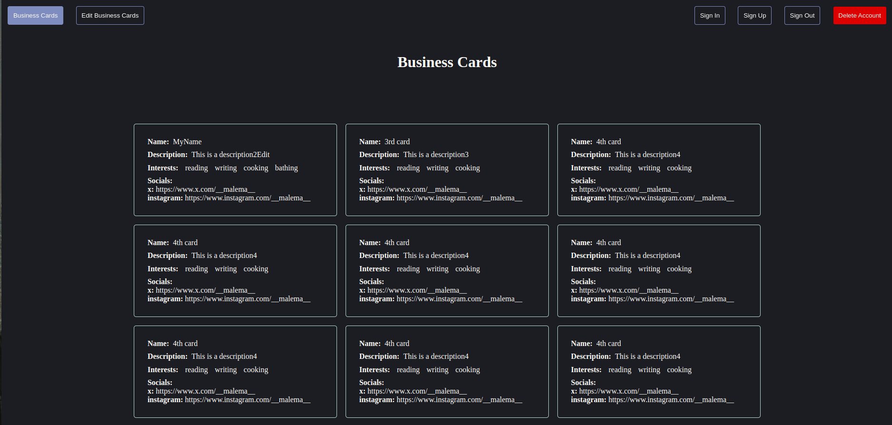
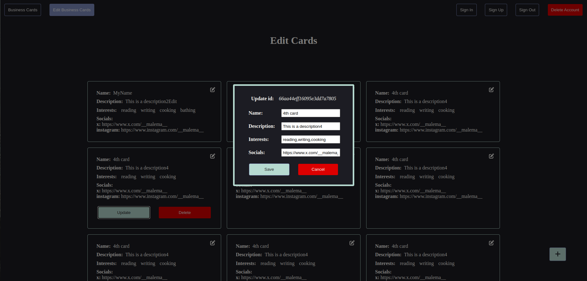

# A simple CRUD application made in MERN stack

## Features

- **Sign Up:** add a privileged user with read, write and delete capabilities to the database
- **Sign In:** verify your user with json web tokens
- **Delete Admin:** delete the admin from the database
- **Sign Out:** clear the localstorage from your browser
- **Business Cards:** landing page with all the business cards in the database
- **Edit Business Cards:** Add, Delete or Update business cards (privileged actions)

## Landing Page

## Edit Page

